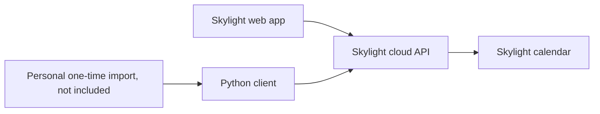
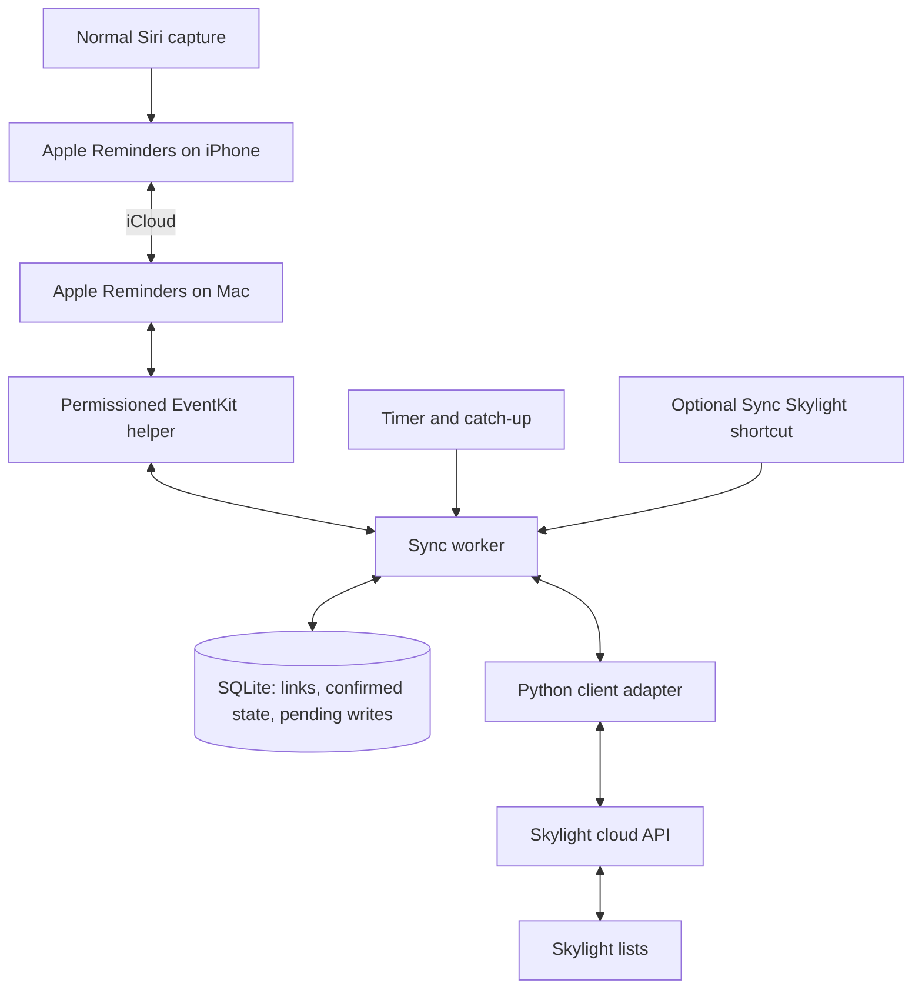

# Making the lists automatic

Design notes, September 25, 2026. **This is a proposal, not an implemented sync service.** The public client has only been tested offline. The original personal experiment copied 33 reminders successfully; that does not establish that the cleaned client or any automation below works live today.

The thing I want is simple: hold the button on my phone, tell Siri to remind me about something, and see it on Skylight. Check it off on either device and have it stay checked off.

I don't want a second capture habit or a recurring job called “update the other list.” A delay is acceptable for a first version. Duplicate tasks and mysteriously unchecked boxes aren't.

## What exists today

The client handles paths, authentication, and payloads. It can read lists, create items, and set their completion status. There is no Reminders reader, scheduler, identity database, or sync worker. The private import receipts contain Skylight IDs, not a complete mapping back to Apple Reminders.

Scheduling the original importer would repeat a copy operation. It would not turn it into synchronization.

## Options we're considering

| Option | Why it is appealing | Where it falls short | Current decision |
| --- | --- | --- | --- |
| IFTTT → webhook → our client | Has triggers for new and completed Apple Reminders. Keeps normal Siri capture. | Needs a reachable, authenticated bridge to the client. iPhone background checks can be delayed or stop. Matching, refresh, and the return path from Skylight still need code. | Possible, but not the first build. |
| iPhone Shortcut → Skylight API | Can read Reminders and send HTTP requests. Could avoid an always-on Mac. | Has to implement token refresh, durable mappings, and retry handling on the phone. No generic reminder-created/edited/completed trigger was found in Apple's documented trigger catalog. Scheduled runs are catch-up, not immediate sync. | Worth a small experiment if removing the Mac becomes the priority. |
| A custom Siri shortcut that writes to both | Explicitly running a shortcut could start both writes immediately. | Changes the capture phrase or interaction. Partial success still needs recovery. It only covers reminders created through that shortcut. | Doesn't preserve the habit this project is meant to support. |
| Shortcut → a fixed command on the Mac | Reuses the Python client and keeps credentials and mappings in one place. | Mac must be awake, reachable, and configured for SSH. The newest iPhone reminder may not have reached the Mac yet. | Useful optional “Sync Skylight now” button, not the whole sync system. |
| A small Mac worker | Uses the normal iCloud Reminders flow and can read both sides regularly. Reuses the client. | Needs a permissioned Reminders helper, local state, and an awake Mac with the relevant user session. No instant-delivery guarantee. | Best first implementation for this workflow. |

These are design judgments based on the capabilities below, not results from completed prototypes.

### What the platform docs actually say

- **IFTTT:** [Apple Reminders](https://ifttt.com/ios_reminders) provides new-reminder and completion triggers. Its [web request action](https://ifttt.com/maker_webhooks/actions/make_web_request) can call a publicly reachable endpoint. However, IFTTT explicitly says [iOS background syncing can be unreliable](https://help.ifttt.com/hc/en-us/articles/115010193327-About-iOS-background-syncing); it may stop if the app is not opened for a day or two. Advertised polling intervals are not an end-to-end delivery guarantee.
- **Shortcuts:** [Find Reminders](https://support.apple.com/guide/shortcuts/apd3c845e881/ios) reads reminder data, and [Get Contents of URL](https://support.apple.com/guide/shortcuts/apd58d46713f/ios) supports API requests. [Time and app automations can run automatically](https://support.apple.com/guide/shortcuts/add-automations-apdfbdbd7123/ios), subject to action permissions. An [app-close trigger](https://support.apple.com/guide/shortcuts/apde31e9638b/ios) does not reliably catch ordinary Siri capture: Siri can add a reminder without opening or closing Reminders. I couldn't find a documented generic reminder-change trigger; that is a limitation of the documented options, not proof that no future workaround could exist.
- **Mac bridge:** [iCloud Reminders](https://support.apple.com/guide/icloud/mmc591432bd9/icloud) carries creation and completion changes between configured Apple devices. A helper would use [EventKit's Reminders access](https://developer.apple.com/documentation/eventkit/ekeventstore/requestfullaccesstoreminders(completion:)) to read and write the selected list. An optional SSH shortcut also needs [Remote Login](https://support.apple.com/guide/mac-help/mchlp1066/mac), authentication, and network access to the Mac. SSH permission does not grant Reminders permission.

I didn't find a native Skylight list action for either IFTTT or Shortcuts in this review. The custom-client route still depends on the unofficial interface described in [README.md](README.md) and [DISCLAIMER.md](DISCLAIMER.md).

## The rough version I'd build

One Mac. One ordinary iCloud Reminders list. One Skylight list. A small EventKit helper, the existing Python adapter, and SQLite. No hosted service or new phone app for the first pass.

The Mac needs iCloud Reminders enabled for the relevant account and a helper granted read/write access. The worker would run periodically while the Mac is awake and catch up after sleep. A user LaunchAgent is a candidate scheduler; its actual background permission behavior needs testing with the helper. The first version can run manually before adding scheduling. No immediate iCloud delivery assumption: each pass reconciles what is currently visible and checks again later.

Putting Python on a cloud server alone doesn't solve the input side. That server would still need a supported, permissioned way to receive Apple Reminders changes. A Mac that stays on is the smaller next step if laptop sleep becomes annoying.

### Keep the first set of rules small

| Data or event | Proposed first-version behavior |
| --- | --- |
| New reminder | Create one Skylight item for an active, nonrecurring reminder in the selected list, after resolving existing imports. Do not backfill all historical completed reminders. |
| Wording | Apple Reminders owns it. The client currently has no dedicated list-item rename method. Flag later title changes until rename behavior has been verified; never delete and recreate an item just to rename it. |
| Due date and notification | Stay in Apple Reminders. The current list-item payload has no due-date field. Seeing a task on Skylight does not mean its Siri-created alert moved there. |
| Check-off | Completion travels either way for an explicitly linked item. Only write completion automatically, not a whole stale copy of the reminder. |
| Uncheck/reopen | Stop automatic changes for that pair and request review. Do not use “last write wins” or immediately check it off again. Automatic reopening can come later. |
| Recurring reminders | Exclude and report them initially. Completing a recurrence needs its own identity and next-occurrence design. |
| Missing or deleted item | Leave the other side alone and flag the pair. No automatic delete or recreation in v1. |
| Unrelated Skylight items | Leave them alone. Only mapped items belong to the worker. |

The earlier one-way idea would have overwritten a check-off made on Skylight. That defeats the main reason I use its lists. Completion in both directions belongs in the useful first version; general two-way editing does not have to.

For a pair last confirmed as pending on both sides, seeing either side completed would propose completing the other. Once completion has been confirmed, seeing that side become pending is a possible reopen: flag it instead of guessing. Initial state disagreements also need review. Polling sees snapshots, so a check-and-uncheck entirely between reads may be invisible; this is not an event history.

### Identity and recovery are the actual work

Persist source account/list context, Apple item ID, Skylight item ID, each side's last confirmed completion state, and unresolved operations. A task title is not an ID: two items can have the same title, and titles can change. [Apple's local item identifiers can also change after a full sync](https://developer.apple.com/documentation/eventkit/ekcalendaritem/calendaritemidentifier), so unresolved identity must pause creation for the affected source scope until it is reconciled.

The existing 33 copies need explicit pairing before writes are enabled for that list. Their saved Skylight IDs help, but labels alone cannot establish the source identity. Adoption should show candidates for review, leave ambiguous pairs unresolved, and never publish that private mapping.

Each pass would:

1. Acquire a single-run lock. Read the selected Apple list, including completed items, and the complete target list. Verify Skylight reads include completed items and every page; the current wrapper does not establish that completeness. If either read fails or is incomplete, make no writes.
2. Resolve pending operations and identity changes before planning new work. Reconsider pending status writes against fresh reads instead of replaying stale intent. Block affected pairs or the source scope when uncertain.
3. Compare both snapshots with the last confirmed state. Propose only supported changes, and send conflicts to review.
4. Save a pending operation before a write. Recheck the relevant current state before applying it. Read back the result before marking it confirmed.
5. Record last successful reconciliation, waiting changes, and unresolved problems. Back off on temporary errors and surface persistent failures.

A create timeout is the awkward case. The server may have saved the item even if the client never received its ID. A crash after the response but before committing SQLite has the same problem. Do not blindly retry. Remote idempotency support has not been verified; without it, ambiguous creates require reconciliation or manual resolution. A SQLite journal makes uncertainty visible; it cannot make two separate systems transactional. One worker also cannot prevent a person editing either app during a sync.

The client needs structured errors instead of exiting the process. Refresh must keep its existing credential-provenance protections, and tokens, state, and reminder contents stay outside Git and public logs.

## Small steps that would prove it works

1. **Read-only plan:** build the permissioned reader and compare two disposable lists. Confirm complete reads, identities, and what the worker would change. No real reminder migration yet.
2. **Manual round trip:** create one ordinary reminder, run once, verify exactly one Skylight item, and run again to confirm no duplicate. Complete it on Skylight and verify Apple reflects that. Use a second item to test completion from Apple.
3. **Recovery:** test sleep/offline catch-up, denied permission, a renamed item, duplicate titles, a reopened item, a missing item, and a create whose outcome is unknown. These should either converge under the rules above or visibly stop for review.
4. **Adopt existing items, then schedule:** review the old imports, enable one list, and verify the same helper works from its background launcher. Add a Shortcut only if a manual sync button is useful.

Success is modest: ordinary Siri capture still works, each selected task appears once, and a check-off survives the next pass. Due alerts stay with Apple. Delays during sleep are visible. Anything ambiguous waits instead of quietly making a mess.

None of this worker, its storage, its helper, or its Shortcuts/IFTTT setup is included yet. This is the next build to validate, not a claim that adding a timer makes the current importer safe.
