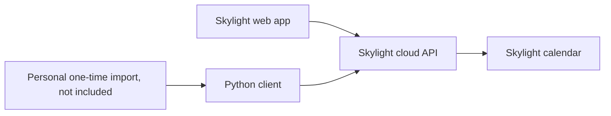
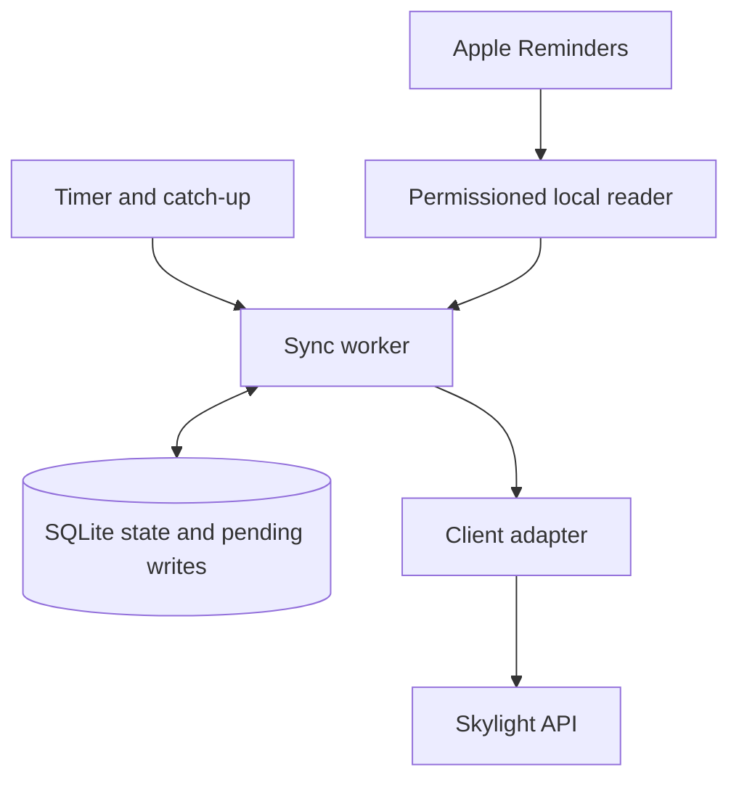

# A client first, synchronization later

The prototype put the service-specific details in a Python adapter. The personal import called that adapter; the physical calendar displayed its normal cloud data.

The adapter owns paths, authentication, and payloads. A future worker would own source selection, identity, synchronization rules, and recovery. The current module is a CLI-oriented prototype; its exit-on-error behavior would need replacing with structured exceptions before use in a long-running worker.

## Proposed automatic version — not implemented

Subject to permission to use the service this way, a local helper could read a selected Reminders list, including completed items, and reconcile it with Skylight.

The decisions to settle before building it:

- **Authority:** begin with Reminders owning text and completion state. A one-way mirror would overwrite edits made on Skylight; that tradeoff should be explicit before adding two-way changes.
- **Identity:** persist source-to-target mappings, source account/list context, and confirmed state. [Apple's local item identifiers can change after a full sync](https://developer.apple.com/documentation/eventkit/ekcalendaritem/calendaritemidentifier); unresolved identity must not create a duplicate.
- **Adoption:** explicitly pair any previously imported items with their sources before the first automatic run. Labels alone are not reliable identities.
- **Unknown results:** record a pending write before sending it. A timeout, or a crash after the server saved an item but before local state committed, is not a signal to repeat the create. Resolve the result first. Remote idempotency support has not been verified.
- **Reconciliation:** read the target back even when the source appears unchanged. A local hash cannot detect edits made on the calendar.
- **Unavailable data:** failed permission checks or incomplete source reads must not be treated as an empty list. Leave missing-source items untouched in the first version.
- **Scheduling:** one run at a time, bounded requests, and catch-up to current state when the Mac wakes. Back off on temporary errors and surface persistent failures.

No scheduler, EventKit reader, database, operation journal, or automatic-sync implementation is included here. The diagrams describe a possible next design, not shipped functionality.
